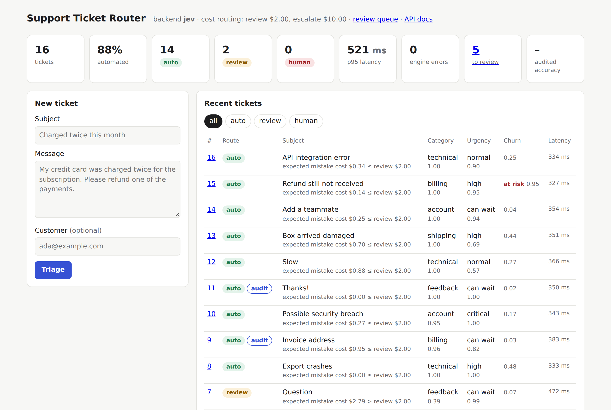
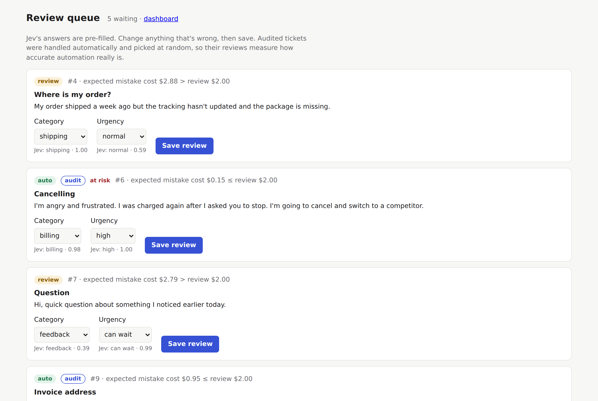
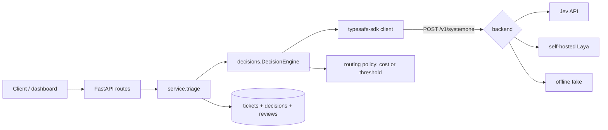

# Support Ticket Router

[](https://github.com/khaledjamal/support-ticket-router/actions/workflows/ci.yml)

Sorts customer support tickets automatically and sends the uncertain ones to a person.

For every ticket, the service asks [Jev](https://typesafe.ai) three questions in one API call, then decides
**how much to trust the answers** before acting on them.

- **What team?** a `Choice` among billing, technical, account, shipping and feedback
- **How urgent?** a `Score` against a five-level rubric, from "can wait" to "critical"
- **Is the customer about to leave?** a `Noul` (a yes/no probability)



Jev is trained to return calibrated probabilities: when it says 0.9, it should be right about 90% of the time
(the [benchmark](#benchmark-can-the-confidence-be-trusted) below checks how close it gets). That turns "should
a person check this?" into arithmetic. The default **cost routing** multiplies the chance of each possible
mistake by what that mistake would cost:

| Expected cost of acting automatically | Route    | Meaning                                         |
|---------------------------------------|----------|-------------------------------------------------|
| ≤ $2 (the cost of a quick review)     | `auto`   | Assign to the team queue, no human needed       |
| $2 – $10                              | `review` | Assign, but queue for a quick human check       |
| > $10, or Jev unreachable             | `human`  | Too risky for a quick check; a person handles it |

So a 30% chance of the wrong team is fine for a routine ticket ($1.50) but not for a customer who is about to
leave ($3.00). A 10% chance that a "normal" ticket is really an outage costs more than a 40% chance that it's
merely "low". The dollar figures in [`costs.py`](src/triage/costs.py) are illustrative; set your own.

`TRIAGE_ROUTING=threshold` switches to a simpler rule: automate when every answer is at least 0.85 certain.
`uv run triage-policies` replays stored answers under both rules, side by side, without calling Jev.

Support teams call this first sorting step *triage*: deciding who handles each ticket and how soon. The code
uses that name: the Python package is `triage`, and its settings start with `TRIAGE_`.

## Benchmark: can the confidence be trusted?

Cost routing is only as good as the probabilities behind it. TypeSafe claims Jev is calibrated where
preference-trained LLMs are overconfident, so I measured it. Jev and three LLMs classified 462 questions
from **Banking77** (PolyAI's human-written benchmark, 77 intents). Each LLM answered under a JSON schema
restricted to the allowed options and stated its confidence. All models ran through OpenRouter.


| Model | Accuracy | Calibration error (ECE) | Answers ≥90% confident | …of which right | p50 latency | $ per 1k |
|---|---|---|---|---|---|---|
| **Jev 1.13** | **79.2%** | **10.4%** | 72.9% | **89.0%** | **346 ms** | **$0.07** |
| GPT-4.1 mini | 76.0% | 17.7% | 91.8% | 79.7% | 877 ms | $0.44 |
| Claude Haiku 4.5 | 74.9% | 10.8% | 53.2% | 89.0% | 1,434 ms | $1.82 |
| Gemini 2.5 Flash | 77.3% | 20.8% | 99.8% | 77.4% | 786 ms | $0.27 |

What this shows:

- **Jev was the best calibrated, and by far the fastest and cheapest:** 2.3× faster than the quickest LLM and
  4–26× cheaper. Accuracy was similar across models: with 462 questions, gaps of 2–4 points are within noise.
- **Two of the three LLMs were clearly overconfident.** Gemini said "90% sure or more" about almost every
  answer, but those answers were right 77% of the time. That's the gap that makes unattended automation unsafe.
- **Overconfidence isn't universal, though.** Claude Haiku was about as well calibrated as Jev, at 25× the
  cost and 4× the latency.
- **Jev isn't perfectly calibrated either.** It averaged 89% confidence for 79% accuracy, and its accuracy is
  below the 87% TypeSafe publishes for Banking77. Thresholds should come from measured data, which is what
  the review queue's audit sample is for.

A second run on 300 synthetic support tickets (queue and priority) gave every model only 27–51% accuracy. The
labels in that dataset were themselves generated by AI, and the queues overlap heavily, so I treat it as a
check of the pipeline rather than of the models. The full report, with all tables and charts, is in
[`results/benchmark/report.md`](results/benchmark/report.md). Reproduce it with
`uv run triage-bench run --dry-run` (cost estimate), then `uv run triage-bench run` and
`uv run triage-bench report`. The whole run cost $1.60.

## Quick start

Requires [uv](https://docs.astral.sh/uv/), which also installs the right Python. No API key is needed: the
default backend runs offline.

```bash
uv sync
uv run triage-seed                                         # triage 16 sample tickets into ./triage.db
uv run uvicorn triage.main:create_app --factory --reload   # http://localhost:8000
```

The dashboard is at `/`, the review queue at `/review`, and interactive API docs at `/docs`.

Or run it with Docker (it reads `.env` if there is one, and keeps tickets in a named volume):

```bash
docker compose up --build   # http://localhost:8000
docker compose down         # stop; add -v to also delete the stored tickets
```

To keep older builds, tag each one with its git commit as well as `latest`; then any of them can be run again:

```bash
docker build -t support-ticket-router:latest -t support-ticket-router:$(git rev-parse --short HEAD) .
docker images support-ticket-router                              # the builds you have
docker run --rm -p 8000:8000 support-ticket-router:<commit>       # run an older one
```

To use the real model, copy `.env.example` to `.env`, set `TRIAGE_BACKEND=jev`, and add a key. Either of these works:

- **TypeSafe:** set `TYPESAFE_API_KEY` to a key from [console.typesafe.ai](https://console.typesafe.ai/).
- **OpenRouter:** put an OpenRouter key in `TYPESAFE_API_KEY`, and set `TRIAGE_JEV_BASE_URL=https://openrouter.ai/api`
  and `TRIAGE_MODEL=typesafe/jev-1.13`. OpenRouter serves the same `/v1/systemone` protocol. Note that
  `typesafe/jev-router` is a different product: a chat router with no confidence output.

## API

| Method | Path                 | Description                                                  |
|--------|----------------------|--------------------------------------------------------------|
| POST   | `/api/tickets`       | Triage and store a ticket: `{"subject", "body", "customer"?}` |
| GET    | `/api/tickets`       | Newest first; `?route=auto\|review\|human`, `?limit=`         |
| GET    | `/api/tickets/{id}`  | One ticket with its raw decision                              |
| GET    | `/api/review-queue`  | Tickets waiting for a person, oldest first                    |
| POST   | `/api/tickets/{id}/review` | Record the correct answers: `{"category", "urgency_level"}` |
| GET    | `/api/stats`         | Counts per route, automation rate, errors, p50/p95 latency, review accuracy per route |
| GET    | `/healthz`           | Liveness and the active backend                               |

The review queue is also a page at `/review`. Jev's answers come pre-filled, so confirming a correct ticket is
one click. Randomly audited `auto` tickets appear here too, marked "audit".



```bash
curl -s localhost:8000/api/tickets -H 'content-type: application/json' \
  -d '{"subject": "Charged twice", "body": "My card was charged twice this month, please refund one."}'
```

## Architecture



```
src/triage/
├── decisions/        # generic: knows nothing about tickets
│   ├── policy.py     #   routing policies: expected cost, or certainty thresholds
│   ├── engine.py     #   one round trip, timing, failure -> human fallback, structured logs
│   ├── backends.py   #   Jev / Laya / fake client construction
│   └── fake.py       #   offline /v1/systemone stand-in
├── bench/            # benchmark: datasets, Jev and OpenRouter clients, metrics, report, charts
├── questions.py      # the three ticket questions and which answers are acted on
├── costs.py          # what each kind of triage mistake costs
├── service.py        # triage, review queue and stats
├── db.py             # SQLAlchemy models: tickets (with reviews), and one decision record per ticket
├── api.py, web.py    # JSON API, HTMX dashboard and review page
└── main.py           # app factory and settings wiring
scripts/
├── smoke.py          # calls every endpoint of a running app and checks the responses
└── screenshot.py     # README screenshots with headless Chromium
results/benchmark/    # benchmark report, JSON summary and calibration charts (committed)
.github/workflows/    # CI: format check, lint and tests on every push and pull request
```

## Design decisions

**Route on what a mistake would cost, not on confidence alone.** A confidence threshold treats every
uncertainty the same. But being unsure whether a ticket is "low" or "normal" is cheap, while a small chance
that it's an unnoticed outage is not. Cost routing uses each answer's full probability distribution, so it
automates more of the cheap uncertainty and less of the expensive kind. On the 16 sample tickets, replaying
the same Jev answers, it automated 14 instead of 11.

**This only works with calibrated probabilities.** Expected cost is probability × cost. If "90% sure" really
means 70%, every expected cost is wrong. That's why the review queue samples automated tickets at random:
it's how calibration gets checked.

**Churn risk raises the stakes, but never blocks on its own.** A customer who is about to leave makes any
mistake up to 3× as costly. An uncertain churn guess on a clearly-categorised ticket doesn't stop automation.
The threshold policy ignores churn entirely and shows it only as an "at risk" flag.

**Noul answers need their own certainty.** The API returns `confidence` for choice and score answers, but a noul
answer is only P(yes). For threshold routing, its certainty is taken as the distance from a coin flip,
`|2p − 1|`, so 0.5 → 0 and 0.02 or 0.98 → 0.96. Cost routing uses P(yes) directly, as a probability.

**Outages degrade to manual triage, not lost tickets.** After the SDK's own retries, API and connection errors
route the ticket to `human` with the error recorded, and the API still returns 201.

**One decision record per ticket.** Raw answers, model, latency and token usage are stored separately from the
ticket fields. That is the data needed to check calibration later against human corrections.

**Audit a random sample of automated tickets.** If people only ever see the uncertain tickets, nobody learns how
accurate the automated ones are, which is the blind spot of unattended automation. A random 5% of `auto`
tickets (`TRIAGE_AUDIT_RATE`) also go to the review queue, so automated accuracy is measured on an unbiased
sample. Accuracy on `review` and `human` tickets is reported separately, because those tickets were chosen for
being hard.

**Use the official SDK, don't wrap it.** `typesafe-sdk` already provides typed questions and answers, retries with
backoff, timeouts and an error hierarchy. The `decisions` package adds only what it lacks: routing on confidence,
backend selection and failure handling.

**One protocol, three backends.** Laya serves the same `POST /v1/systemone` protocol, so a
self-hosted model is a `base_url` change. The offline fake plugs into the SDK as an `httpx2.MockTransport`, so tests
and demos run the real SDK's request building and response validation without a network or a key.

**Why not [Hunch](https://github.com/steven-shoemaker/hunch)?** Hunch is a good fit for batch analysis: it classifies
pandas columns with caching and deduplication. This project is about decisions inside a live request path, where
the question is whether to act without a person.

## Configuration

Environment variables, or a `.env` file (see `.env.example`):

| Variable                  | Default                           | Purpose                                     |
|---------------------------|-----------------------------------|---------------------------------------------|
| `TRIAGE_BACKEND`          | `fake`                            | `fake`, `jev` or `laya`                     |
| `TYPESAFE_API_KEY`        |                                   | TypeSafe or OpenRouter key                  |
| `TRIAGE_JEV_BASE_URL`     | TypeSafe's API                    | e.g. `https://openrouter.ai/api`            |
| `TRIAGE_LAYA_BASE_URL`    |                                   | laya-serve URL, for the `laya` backend      |
| `TRIAGE_LAYA_API_KEY`     |                                   | Laya bearer key, if the server requires one |
| `TRIAGE_ROUTING`          | `cost`                            | `cost` or `threshold`                       |
| `TRIAGE_REVIEW_COST`      | `2.0`                             | Cost routing: maximum expected cost for `auto` |
| `TRIAGE_ESCALATE_COST`    | `10.0`                            | Cost routing: maximum expected cost for `review` |
| `TRIAGE_AUTO_THRESHOLD`   | `0.85`                            | Threshold routing: minimum certainty for `auto` |
| `TRIAGE_REVIEW_THRESHOLD` | `0.60`                            | Threshold routing: minimum certainty for `review` |
| `TRIAGE_AUDIT_RATE`       | `0.05`                            | Share of `auto` tickets also sent to review |
| `TRIAGE_MODEL`            | SDK default (`jev-latest`)        | Model name                                  |
| `TRIAGE_REQUEST_TIMEOUT`  | `5`                               | Seconds per HTTP attempt                    |
| `TRIAGE_DATABASE_URL`     | `sqlite+aiosqlite:///./triage.db` | SQLAlchemy async URL                        |
| `OPENROUTER_API_KEY`      | `TYPESAFE_API_KEY` if Jev uses OpenRouter | Benchmark only: key for the LLMs    |

## Development

Run the app:

```bash
uv run uvicorn triage.main:create_app --factory --reload           # http://localhost:8000, reloads on code changes
TRIAGE_BACKEND=fake uv run uvicorn triage.main:create_app --factory  # offline, even if .env selects Jev
```

Format, lint and test (the same checks CI runs):

```bash
uv run ruff format .        # format the code (CI uses --check)
uv run ruff check --fix .   # lint, fixing what can be fixed automatically
uv run pytest               # the 78 offline tests
```

Sample data and reports:

```bash
rm -f triage.db && uv run triage-seed   # start over: triage the 16 sample tickets into a new ./triage.db
uv run triage-tickets [path.db]         # routing table: route, answers, confidence and latency per ticket
uv run triage-policies [path.db]        # replay stored answers under both routing policies, side by side
uv run triage-bench run --dry-run       # benchmark cost estimate; then `run` and `report` (see results/benchmark/)
```

Smoke test against a running app, on a throwaway database (it creates one ticket):

```bash
TRIAGE_DATABASE_URL=sqlite+aiosqlite:///./smoke.db uv run uvicorn triage.main:create_app --factory
uv run python scripts/smoke.py http://127.0.0.1:8000   # in a second terminal
```

Screenshots for this README, taken from the app while it serves `./triage.db`:

```bash
uv run --group docs python scripts/screenshot.py http://127.0.0.1:8000 docs
```

GitHub Actions runs the format check, lint and tests on every push and pull request
([`.github/workflows/ci.yml`](.github/workflows/ci.yml)). The tests need no network, key or data.

Screenshots use Playwright, kept in a separate `docs` dependency group so CI and normal installs skip it. The
first time, install its browser with `uv run --group docs playwright install chromium-headless-shell`. On a
bare Linux or WSL system, Chromium also needs a few system libraries; on Ubuntu,
`sudo apt install libnss3 libnspr4 libasound2t64`.

## About the fake backend

`decisions/fake.py` scores each option by the words it shares with the ticket: clear tickets get confident
answers and vague ones don't, which is enough to exercise every route. It is a heuristic, not a model, and
says nothing about how Jev performs.

## Status and roadmap

Tested offline (78 tests, run in CI) and against live Jev (`jev-1.13`) through OpenRouter. On the 16 sample
tickets with cost routing, 14 went `auto` and 2 `review`, at about 350 ms per call; the two angry tickets
scored a churn risk of 0.94 and 0.99. Sixteen tickets is a demo, not an evaluation; the benchmark above measures
accuracy and calibration. Jev's confidence varies slightly between identical calls, so a ticket close to a
routing boundary can land on either side of it.

The Docker image (Python 3.13 slim, runs as a non-root user, with a health check) passes the smoke test both
offline and against live Jev, and tickets survive the container being recreated. Not yet tested: a Laya server.

There are no database migrations yet. The app refuses to start on a database with an older schema and says how
to recreate it.

Next:
- [x] Human review screen: confirm or correct a decision, storing corrections as ground truth
- [x] Random audit sample of automated tickets, with accuracy per route
- [x] Cost-based routing: automate only when the expected cost of a mistake is below the cost of a review
- [x] Benchmark: Jev against three LLMs on accuracy, calibration, latency and cost, with reliability charts
- [ ] Calibration chart in the app itself, built from review-queue corrections
- [ ] Tune the cost figures and thresholds from labelled data instead of picking them
- [x] CI: format check, lint and tests on GitHub Actions
- [ ] Type checking (mypy or pyright) in CI
- [ ] Postgres, Alembic migrations and a background worker queue
- [ ] Hosted demo on the offline backend
