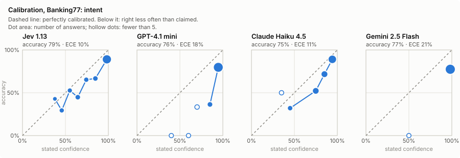
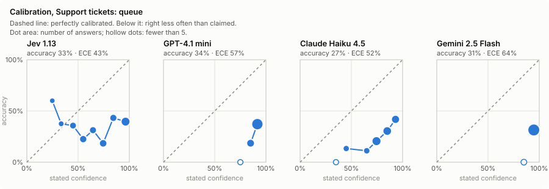
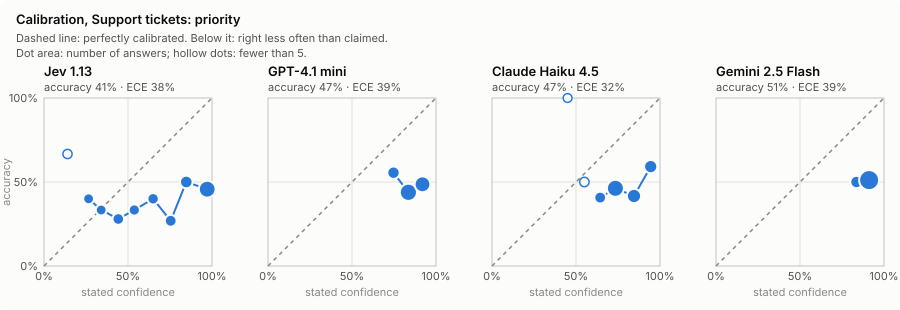

# Benchmark: Jev vs LLMs

Generated 2026-10-04 by `uv run triage-bench report`. Jev model: `typesafe/jev-1.13`. All models called through OpenRouter. LLMs answered under a JSON schema listing the allowed options, at temperature 0, and stated their confidence (0–100) with each answer.

- **Overconfidence:** average stated confidence minus accuracy, in percentage points. Positive means the model claims more than it delivers.
- **ECE:** expected calibration error: the average gap between confidence and accuracy, after grouping answers by confidence. Lower is better.
- **Answers ≥90% confident / …and right:** what an automated system would act on without review, and how often it would be right.
- **Latency** is wall time per call from the benchmark machine through OpenRouter, including any rate-limit retries. **Cost** is what OpenRouter billed (for Jev: input tokens × its listed price).
- One run per model. Jev's `confidence` field is used; its separate probability for the chosen option was slightly worse calibrated on every question.

## Banking77: 462 questions, 77 intents (6 per intent)

Source: PolyAI Banking77 test split, human-written, CC BY 4.0.

| Model | Accuracy | Avg confidence | Overconfidence (pts) | ECE | Answers ≥90% confident | …and right | Invalid | p50 / p95 ms | $ per 1k |
|---|---|---|---|---|---|---|---|---|---|
| typesafe/jev-1.13 | 79.2% | 89.4% | +10.2 | 10.4% | 72.9% | 89.0% | 0 | 346 / 476 | $0.071 |
| openai/gpt-4.1-mini | 76.0% | 93.7% | +17.7 | 17.7% | 91.8% | 79.7% | 0 | 877 / 1,226 | $0.438 |
| anthropic/claude-haiku-4.5 | 74.9% | 85.5% | +10.6 | 10.8% | 53.2% | 89.0% | 0 | 1,434 / 8,586 | $1.816 |
| google/gemini-2.5-flash | 77.3% | 98.1% | +20.8 | 20.8% | 99.8% | 77.4% | 0 | 786 / 1,775 | $0.273 |

## Support tickets: 300 English emails, 10 queues, 3 priorities

Source: Tobi-Bueck/customer-support-tickets, synthetic (AI-generated), CC BY-NC 4.0.

### queue

| Model | Accuracy | Avg confidence | Overconfidence (pts) | ECE | Answers ≥90% confident | …and right | Invalid | p50 / p95 ms | $ per 1k |
|---|---|---|---|---|---|---|---|---|---|
| typesafe/jev-1.13 | 33.3% | 74.7% | +41.4 | 42.8% | 33.7% | 39.6% | 0 | 341 / 604 | $0.022 |
| openai/gpt-4.1-mini | 33.7% | 90.3% | +56.7 | 56.7% | 81.7% | 37.1% | 0 | 1,055 / 1,553 | $0.218 |
| anthropic/claude-haiku-4.5 | 27.3% | 79.7% | +52.4 | 52.4% | 22.3% | 41.8% | 0 | 1,681 / 8,756 | $0.929 |
| google/gemini-2.5-flash | 31.0% | 94.6% | +63.6 | 63.6% | 98.7% | 31.4% | 0 | 805 / 1,661 | $0.178 |

### priority

| Model | Accuracy | Avg confidence | Overconfidence (pts) | ECE | Answers ≥90% confident | …and right | Invalid | p50 / p95 ms | $ per 1k |
|---|---|---|---|---|---|---|---|---|---|
| typesafe/jev-1.13 | 41.3% | 77.0% | +35.7 | 38.1% | 46.7% | 45.7% | 0 | 341 / 604 | $0.022 |
| openai/gpt-4.1-mini | 47.0% | 85.6% | +38.6 | 38.6% | 36.3% | 48.6% | 0 | 1,055 / 1,553 | $0.218 |
| anthropic/claude-haiku-4.5 | 47.0% | 78.4% | +31.4 | 31.7% | 16.3% | 59.2% | 0 | 1,681 / 8,756 | $0.929 |
| google/gemini-2.5-flash | 51.0% | 90.3% | +39.3 | 39.3% | 88.0% | 51.1% | 0 | 805 / 1,661 | $0.178 |
